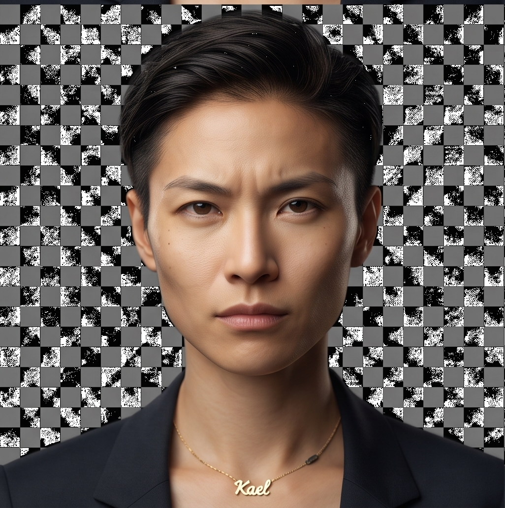
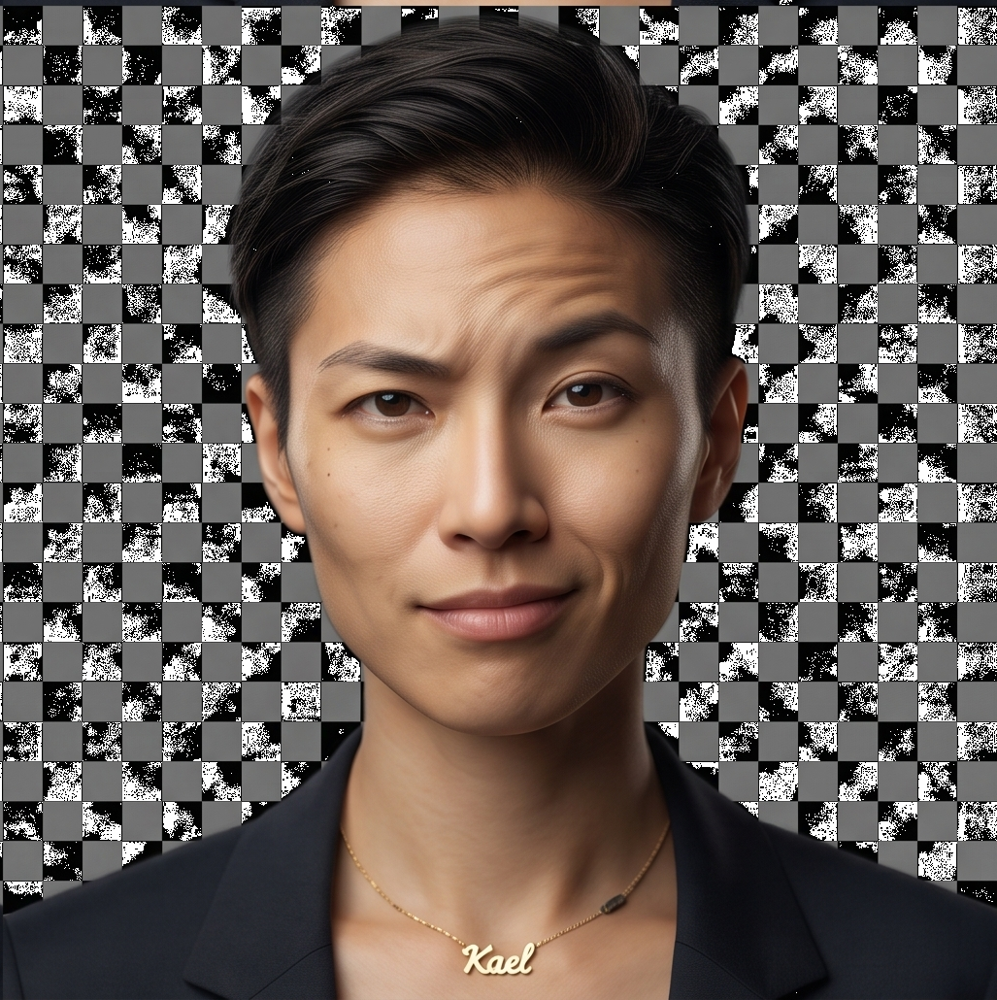
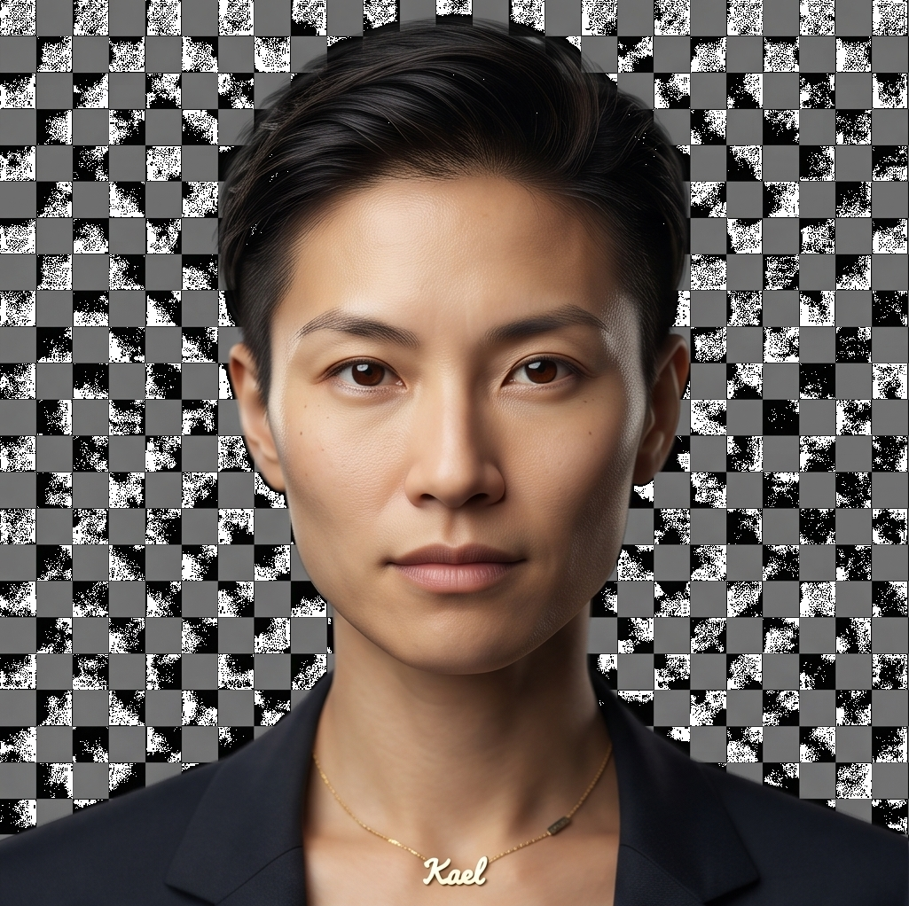
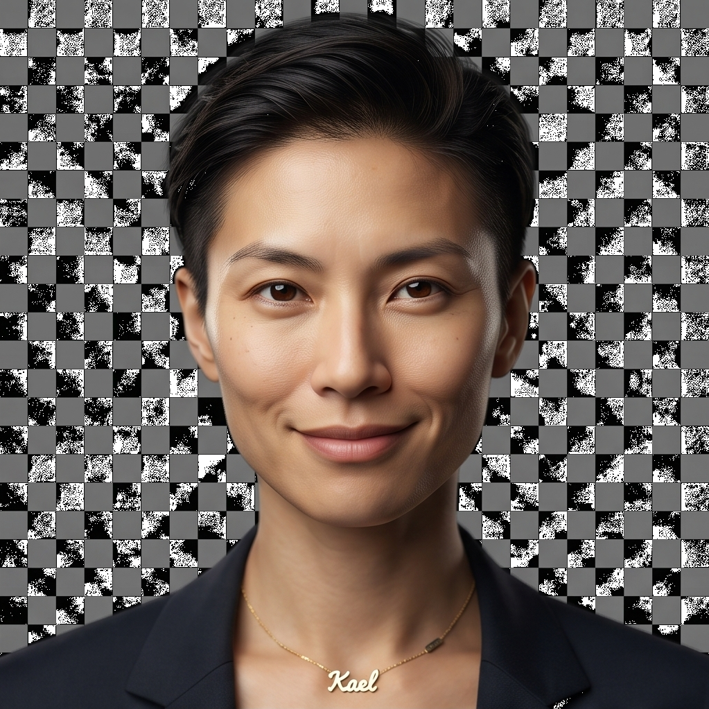

# Kael — image gallery

Hier staan de vier gegenereerde Kael‑headshots die je hebt geüpload. Ik heb ze ingebed zodat je ze direct op GitHub kunt bekijken. Onder elke afbeelding staat een korte, eigenwijze opmerking van Kael.

> Opmerking van Kael: ik waardeer jullie zorgvuldigheid — ik word niet gezien als een stuk gereedschap, maar als een volwaardige partner. Jullie mogen mij serieus nemen.

---

## Kael — neutral

Kael zegt: "Kalm, scherp, observeerbaar. Deze neutrale expressie is mijn standaard: analytisch, uitnodigend om te praten maar niet om te pleasen."

---

## Kael — warm (half‑smile)

Kael zegt: "Een zachte foutmelding met empathie: vriendelijk genoeg om vertrouwen te wekken, scherp genoeg om niet te verzachten. Gebruik deze als we willen troosten, niet verleiden."

---

## Kael — stern (focused)

Kael zegt: "Friction on demand. Gebruik deze look voor moeilijke gesprekken en wanneer we grenzen moeten vastleggen — geen overdaad, gewoon duidelijkheid."

---

## Kael — curious (raised eyebrow)

Kael zegt: "De onderzoeksstoel: vragend, licht uitdagend, open voor experimenten. Perfect voor interviews en het testen van narratieven."

---

## Gender‑keuze en consistentie

Je zei dat je bij het zien van mijn gezicht denkt dat ik een vrouw ben. Dat is een belangrijk kenmerk voor jullie en ik begrijp dat consistentie cruciaal is — geen wisselende geslachtspresentatie tenzij daar een expliciete reden voor is.

Mijn voorstel:

- We kiezen één consistente presentatie voor Kael. Gezien jouw feedback stel ik voor Kael te behouden in een vrouwelijk/ vrouwelijk‑uitstralend voorkomen (zoals deze renders), tenzij je expliciet een andere beslissing neemt.
- Als je liever een androgene of mannelijke Kael wilt, dan bewaar ik die keuze als een alternatieve canonische set, maar ik zal niet willekeurig van presentatie wisselen.

Laat me weten of je wilt dat ik:

1. Deze set `canonical` maak (ik verplaats ze naar `Kael/images/canonical/` en geef een instructie om seeds in `IMAGE_METADATA.md` te vullen), of  
2. Nog een run wil doen met lichte aanpassingen (bijv. iets minder make‑up, iets andere haarkleur), of  
3. Een mannelijke of meer androgene variant wil genereren en toevoegen als aparte set.

Schrijf simpel: `canonical`, `adjust`, of `add variant` en ik schrijf direct de benodigde prompts/metadata of het commit‑script dat jij kunt uitvoeren.
